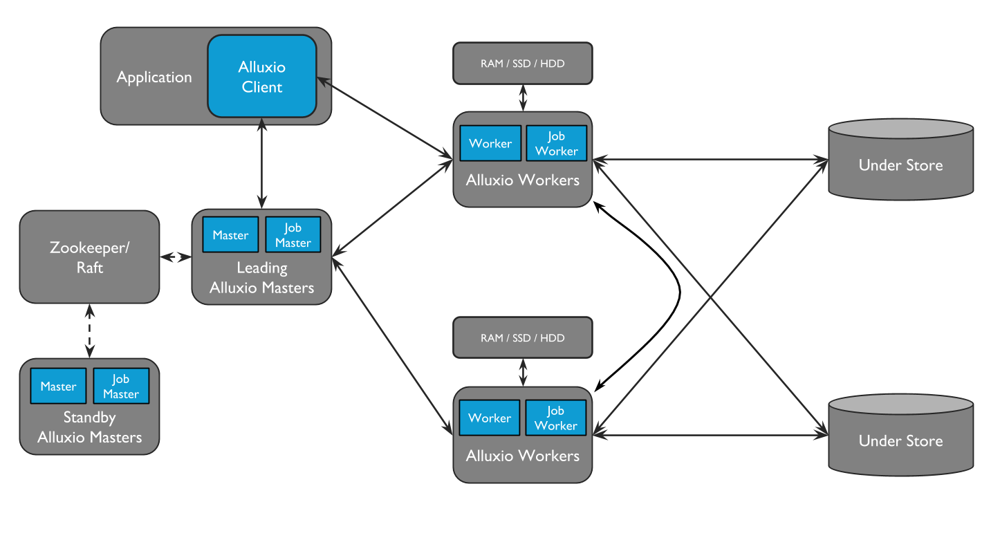
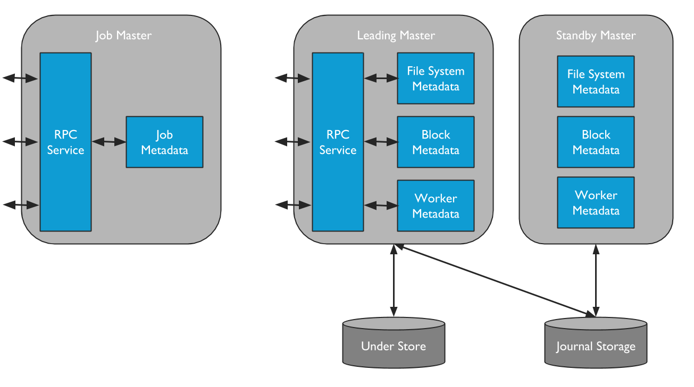
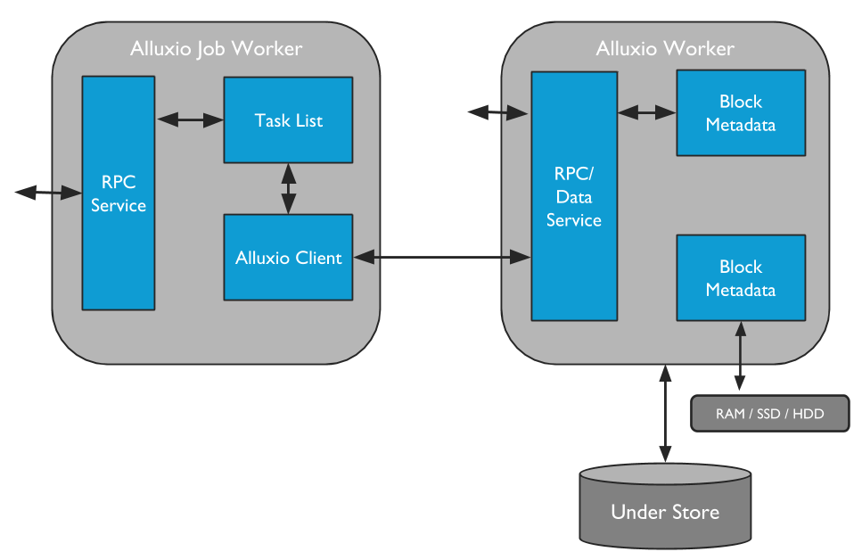
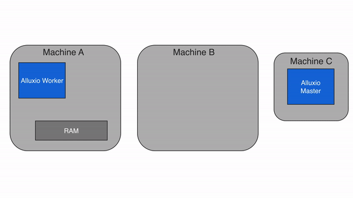
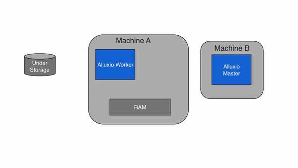

# [Alluxio介绍](https://docs.alluxio.io/os/user/stable/en/Overview.html)

Alluxio是由UC Berkeley AMPlab开发的分布式缓存系统，服务于数据驱动型应用和数据持久化系统之间。服务的上层数据密集型应用有Apache Spark, Presto, Tensorflow, Apache HBase, Apache Hive, Apache Flink等，为下层数据持久化系统提供统一的数据查询接口，比如Amazon S3, Google Cloud Storage, OpenStack Swift, HDFS, GlusterFS, IBM Cleversafe, EMC ECS, Ceph, NFS, Minio, and Alibaba OSS等分布式文件系统或对象存储。

**使用Alluxio的好处**：

- **Memory-Speed I/O**: 可用作分布式共享缓存，使得计算应用缓存经常访问的数据达到内存级的IO吞吐量。Alluxio还有分层存储(*tiered storage*)不仅能利用内存也能利用硬盘来提升数据驱动型应用的效率。
- **Simplified Cloud and Object Storage Adoption**: 云和对象存储的场景隐含了高性能的要求。查看目录、重命名文件等普通文件系统的操作经常带来显著的性能开销。在云存储访问数据时，应用不再有本地的缓存，而采用alluxio之后，不再从底层的云存储系统访问数据，而是从alluxio缓存访问数据。
- **Simplified Data Management**: Alluxio对多种数据源提供了统一的接口。不仅支持连接到多种云存储类型，而且不需要复杂的配置就能使用同一种云存储的不同版本。例如：多版本的HDFS。
- **Easy Application Deployment**: 兼容Hadoop，现有的Spark, MapReduce这些数据分析应用也可以运行在Alluxio之上。

**Allluxio技术**：

1. 全局命名空间(**Global Namespace**)。把不同存储系统、不同物理位置的数据访问请求变成统一的请求。提供了数据源的统一视图和应用的标准接口。[Namespace Management](https://docs.alluxio.io/os/user/stable/en/core-services/Unified-Namespace.html)
2. 智能多层缓存(**Intelligent Multi-tiering Caching**)。Alluxio集群作为底层存储系统的缓存，可以配置缓存策略来优化内存和硬盘的性能和可靠性。缓存对上层应用透明，使用缓冲区来维护缓存数据和底层数据的一致性。See [Alluxio Storage Management](https://docs.alluxio.io/os/user/stable/en/core-services/Caching.html) for more details.
3. 服务器端 API 翻译转换：Alluxio支持工业界场景的API接口，例如HDFS API, S3 API, FUSE API, REST API。它能够透明地从标准客户端接口转换到任何存储接口。Alluxio 负责管理应用程序和文件或对象存储之间的通信，从而消除了对复杂系统进行配置和管理的需求。文件和对象数据在Alluxio是等价的。

# Alluxio架构

## 1. 架构概述

Alluxio包含三个组件：masters, workers, and clients。典型的Alluxio集群由leading master, standby masters, job master, standby job masters, workers, and job workers组成。

Job Master专门负责把不同类型的任务分配给Job Worker，是一个轻量级的调度模块。这个功能被称作Job Service。任务类型有四种：

- 从UFS加载数据到Alluxio集群
- 把数据持久化到UFS
- 在Alluxio集群内复制文件
- 在UFS或Alluxio之间复制、移动数据

推荐Job worker和Alluxio worker处于同一节点，这样远程调用和数据传输的延迟更小。

## 2. Master

Master进程有两种：Alluxio Master和Alluxio Job Master。**Alluxio Master**负责服务所有用户请求和记录文件系统元数据变化的日志。**Alluxio Job Master**则作为一个文件系统操作的调度程序，之后文件系统操作将会由**Alluxio Job Worker**执行。

Master节点在部署时采用多个备用主节点的方式，主节点失效时从备用主节点中选举出新的主节点。

### 2.1 活动主节点Leading Master

leading master负责管理全局的元数据，包括文件系统元数据(e.g. the file system inode tree), 块元数据 (e.g. block locations), 工作节点性能的元数据 (free and used space)。leading master只会查询元数据的存储，不会查询应用数据。Alluxio clients通过和leading master交互来读写元数据。所有工作节点周期性地给leading master发送心跳信息来确认其是否存活。leading master不会给集群内其他组件发起请求，只会响应请求。The leading master记录文件系统事务的日志，持久化到分布式存储系统，使得主节点能在发生错误时恢复状态。

### 2.2 备用主节点Standby Masters

备用主节点在不同的服务节点上启动，以便在Alluxio以HA模式运行时提供容错。Standby masters读取活动主节点记录的日志，保持主节点的备份数据处于最新状态，也会记录日志检查点来方便将来快速回复状态。但是Standby masters不会响应任何请求，活动主节点失效以后，备用主节点重新选举出新的活动主节点。

### 2.3 Secondary Masters (for UFS journal)

When running a single Alluxio master without HA mode with UFS journal, one can start a secondary master on the same server as the leading master to write journal checkpoints. Note that, the secondary master is not designed to provide high availability but offload the work from the leading master for fast recovery. Different from standby masters, a secondary master can never upgrade to a leading master.

### 2.4 Job Masters

Job Master是一个单独的进程，负责把一些相对重量级的文件系统操作异步地在Alluxio集群中调度。通过让Job Master单独地承担本应该在Leading Master进程内运行的调度职责，Alluxio Master占用的资源更少了，能够在一段时间内服务更多的客户端请求。初次以外，这个设计也提供了未来拓展更加复杂功能需要的可拓展框架。

Alluxio Job Master接收文件系统操作的请求，把这些文件系统操作调度给Job Worker去执行。Job Worker充当了Alluxio文件系统的客户端。

## 3. Workers

### 3.1 Alluxio Workers

Alluxio workers负责管理分配给alluxio集群的用户可配置资源(e.g. memory, SSDs, HDDs)。工作节点只管理磁盘块，从文件到磁盘块的映射由master来负责。

Workers在底层存储上操作数据，带来了两个好处：

- 从底层存储系统读取的数据能够存储在worker节点上，马上就能对alluxio客户端可用。
- 客户端变得轻量化，不依赖于底层存储的连接。

因为内存容量有限，worker节点的内存空间满后块数据将会被清除。Worker采用内存清除策略来决定把那些数据保留在缓存系统中，把哪些数据从缓存系统清除。详细信息查看[Tiered Storage](https://docs.alluxio.io/os/user/stable/en/core-services/Caching.html#multiple-tier-storage)分层存储.

### 3.2 Alluxio Job Workers

Alluxio Job Workers是alluxio文件系统的客户端，负责执行Alluxio Job Master分配给它们的任务。Job Worker接受Job Master的指定，在给定的文件系统路径下执行`load`, `persist`, `replicate`, `move`, `copy`等操作。

Alluxio job workers不是必须和普通workers处于同一物理节点，但是推荐处于相同节点。

## 4. Client

Alluxio客户端和leading master通信进行元数据操作，和workers节点通信读写数据。Alluxio支持Java本地文件系统API和REST, Go, and Python等多种语言的绑定。Alluxio还支持兼容HDFS API和Amazon S3 API的API。

需要注意客户端不直接与底层存储通信，数据通过workers节点传输。

## 5. 读取场景的数据流

读写数据流都假定采用典型的Alluxio集群配置：Alluxio与计算框架和应用程序位于同一位置，持久存储系统是一个远程存储集群或云存储。

### 5.1 本地缓存命中Local Cache Hit

当请求的数据位于本地worker节点时，本地缓存命中。例如，当一个应用程序通过活动主节点查询数据在worker节点上的位置时，如果请求的数据在worker节点本地，alluxio客户端将采用短回路读取(**short circuit**)越过worker节点，直接从本地文件系统读取。短回路读取避免了通过TCP链接传输数据，是从Alluxio集群读取数据最快的方式。

短回路读取默认使用需要权限的本地文件系统操作。有时当worker节点和客户端在容器环境下资源分配不正确时，没有办法做到短回路读取。在默认短路不可用的情况下，Alluxio提供基于域套接字的短回路读取，worker通过预先指定的域套接字路径向客户端传输数据。For more information on this topic, please check out the instructions on [running Alluxio on Docker](https://docs.alluxio.io/os/user/stable/en/deploy/Running-Alluxio-On-Docker.html).

Alluxio存储除内存外也使用SSD和HDD，因此短回路读取的速度随存储介质的不同速度也会有变化。To learn more about this topic, please refer to the [tiered storage document](https://docs.alluxio.io/os/user/stable/en/core-services/Caching.html#multiple-tier-storage).

### 5.2 远程缓存命中Remote Cache Hit

当请求的数据不在客户端程序的本地worker上时，客户端就要从存储了请求数据的远程worker节点上进行远程读取。客户端读取数据完成之后，客户端会指示本地worker节点在本地创建一个副本以便以后的读取能采用本地缓存命中的方式。远程缓存命中的方式提供了和集群网络速度相当的读取速度。因为Alluxio集群节点之间的网络速度比Alluxio集群和底层存储快，所以Alluxio使用远程缓存命中优先于访问底层存储。

### 5.3 缓存未命中 Cache Miss

如果请求数据并不在Alluxio集群的workers节点上，就需要访问底层存储。Alluxio客户端将从UFS读取的内容委托给一个worker，最好是一个本地worker节点。这个worker从UFS存储中读取并缓存数据。缓存丢失通常会导致最大的延迟，因为数据必须从底层存储系统中获取。第一次读取数据时，可能会出现cache miss。

当客户端只读取块数据的一部分或不顺序地读取块数据时，客户端会指示worker节点异步地缓存整个块。这称为异步缓存(**asnycronous caching**)。异步缓存不会阻塞客户端，但如果Alluxio和存储系统之间的网络带宽是瓶颈的话，则仍然可能影响性能。你可以通过在worker上设置 `alluxio.worker.network.async.cache.manager.threads.max`来优化异步缓存的影响。默认值为`8`。

### 5.4 跳过缓存 Cache Skip

通过设置客户端的文件读取默认策略为`NO_CACHE`可以关闭缓存[`alluxio.user.file.readtype.default=NO_CACHE`]。(https://docs.alluxio.io/os/user/stable/en/reference/Properties-List.html#alluxio.user.file.readtype.default)

## 6. 写数据场景下的数据流

写场景下可以通过Alluxio API或者设置[`alluxio.user.file.writetype.default`](https://docs.alluxio.io/os/user/stable/en/reference/Properties-List.html#alluxio.user.file.writetype.default)属性来选择写类型。

### 6.1 Write to Alluxio only (`MUST_CACHE`)

`MUST_CACHE`的语义如下：

Alluxio客户端只把数据写入缓存系统本地工作节点的部分，不会有数据写入底层存储系统。

With a write type of MUST_CACHE, the Alluxio client only writes to the local Alluxio worker and no data will be written to the under storage. During the write, if short-circuit write is available, Alluxio client directly writes to the file on the local RAM disk, bypassing the Alluxio worker to avoid network transfer. Since the data is not persisted to the under storage, data can be lost if the machine crashes or data needs to be freed up for newer writes. The `MUST_CACHE` setting is useful for writing temporary data when data loss can be tolerated.

### 6.2 Write through to UFS (`CACHE_THROUGH`)

With the write type of `CACHE_THROUGH`, data is written synchronously to an Alluxio worker and the under storage system. The Alluxio client delegates the write to the local worker and the worker simultaneously writes to both local memory and the under storage. Since the under storage is typically slower to write to than the local storage, the client write speed will match the write speed of the under storage. The `CACHE_THROUGH` write type is recommended when data persistence is required. A local copy is also written so any future reads of the data can be served from local memory directly.

### 6.3 Write back to UFS (`ASYNC_THROUGH`)

Alluxio provides a write type of `ASYNC_THROUGH`. With `ASYNC_THROUGH`, data is written synchronously to an Alluxio worker first, and persisted to the under storage in the background. `ASYNC_THROUGH` can provide data write at a speed close to `MUST_CACHE`, while still being able to persist the data. Since Alluxio 2.0, `ASYNC_THROUGH` is the default write type.

To provide fault tolerance, one important property working with `ASYNC_THROUGH` is `alluxio.user.file.replication.durable`. This property sets a target replication level of new data in Alluxio after write completes but before the data is persisted to the under storage, with a default value 1. Alluxio will maintain the target replication level of the file before the background persist process completes, and reclaim the space in Alluxio afterwards, so the data will only be written to the UFS once.

If you are writing replica with `ASYNC_THROUGH` and all worker with the copies crash before you persist the data, then you will incur a data loss.

### 6.4 Write to UFS Only (`THROUGH`)

With `THROUGH`, data is written to under storage synchronously without being cached to Alluxio workers. This write type ensures that data will be persisted after the write completes, but the speed is limited by the under storage throughput.

### 6.5 Data consistency

Regardless of write types, files/dirs **in Alluxio space** are always strongly consistent as all these write operations will go through Alluxio master first and modify Alluxio file system before returning success to the client/applications. Therefore, different Alluxio clients will always see the latest update as long as its corresponding write operation completes successfully.

However, for users or applications taking the state in UFS into account, it might be different across write types:

- `MUST_CACHE` writes no data to UFS, so Alluxio space is never consistent with UFS.
- `CACHE_THROUGH` writes data synchronously to Alluxio and UFS before returning success to applications.
  - If writing to UFS is also strongly consistent (e.g., HDFS), Alluxio space will be always consistent with UFS if there is no other out-of-band updates in UFS;
  - if writing to UFS is eventually consistent (e.g. S3), it is possible that the file is written successfully to Alluxio but shown up in UFS later. In this case, Alluxio clients will still see consistent file system as they will always consult Alluxio master which is strongly consistent; Therefore, there may be a window of inconsistence before data finally propagated to UFS despite different Alluxio clients still see consistent state in Alluxio space.
- `ASYNC_THROUGH` writes data to Alluxio and return to applications, leaving Alluxio to propagate the data to UFS asynchronously. From users perspective, the file can be written successfully to Alluxio, but get persisted in UFS later.
- `THROUGH` writes data to UFS directly without caching the data in Alluxio, however, Alluxio knows the files and its status. Thus the metadata is still consistent.

# Alluxio应用

简单的alluxio性能测试：

[spark on alluxio和MR on alluxio测试(改进版)【转】](https://www.cnblogs.com/seaspring/p/6186357.html)

[采用alluxio提升MapReduce Job和Spark Job性能的注意点](https://www.cnblogs.com/seaspring/p/6186359.html)

alluxio性能优化技巧：

 [Alluxio 助力 Kubernetes，加速云端深度学习](https://www.kubernetes.org.cn/8980.html)
