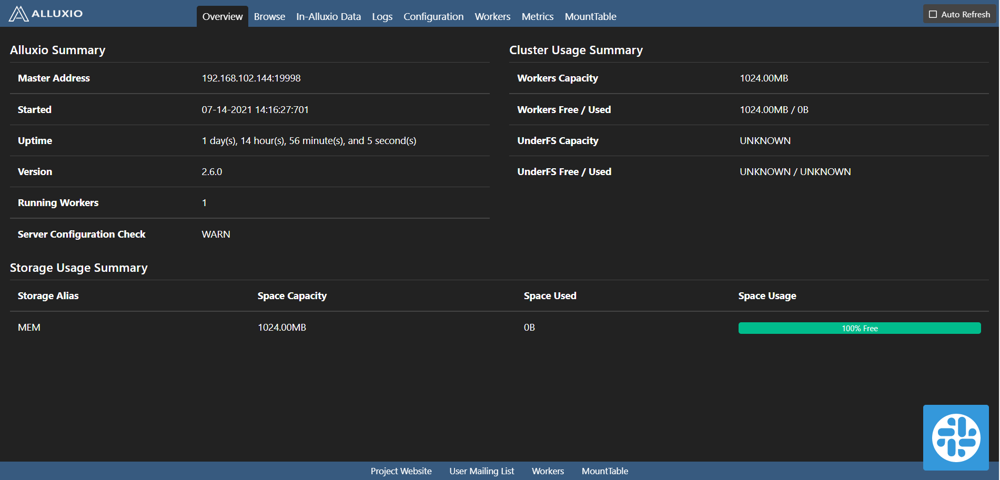
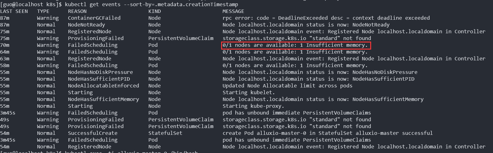
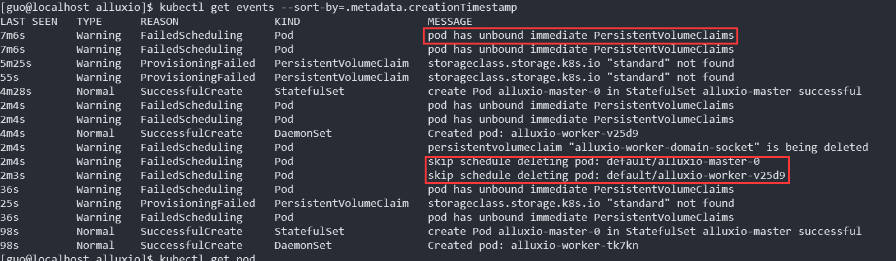

# [部署Alluxio](https://docs.alluxio.io/os/user/stable/en/deploy/Running-Alluxio-On-Kubernetes.html#prerequisites)

## 集群规划

部署前有一个两台机器组成的单控制平面节点的`kubernetes`集群，用于部署缓存系统和底层存储分离的`Alluxio`集群：

- `alluxio-hdfs`: 唯一的控制平面节点。存储型机器，分配了`40G`硬盘，`6G`内存。已经部署了一个单主节点、三台数据节点的`HDFS`集群，空余磁盘容量能够提供实际为`27GB`左右的存储空间。
- `alluxio`：计算型机器，分配了`20G`硬盘，`16G`内存，准备作为运行`Alluxio`集群的节点之一。可以通过克隆`alluxio`主机快速拓展出3台机器组成的`alluxio`集群。

这次部署的`Alluxio`集群将采用单主节点架构，希望控制`master`节点只在`alluxio`机器上运行，其余组件也应该在`alluxio`这台机器和克隆出的其他机器上运行。所以需要用到`nodeSelector`，对`master`使用`kubernetes.io/hostname=alluxio`来限制只能在主机名为`alluxio`的节点上运行，对其余组件使用自定义标签`run=alluxio`，只要给`alluxio`节点和未来克隆出的节点打上这个标记，我们的`Alluxio`集群就不会有组件调度到`alluxio-hdfs`机器上。

已部署的`HDFS`集群也有`kubernetes.io/hostname=alluxio-hdfs`的选择器，所以`HDFS`集群也只会在`alluxio-hdfs`机器上运行。

## 1. 前提条件

- 版本大于等于`1.8`的`k8s`集群。由于`Alluxio`的默认设置可能会用到`emptyDir volumes`，这是`kubernetes 1.8`版本的特性，需要确保此功能开启。
- docker镜像[alluxio/alluxio](https://hub.docker.com/r/alluxio/alluxio/)
- 确保[Kubernetes 网络策略](https://kubernetes.io/docs/concepts/services-networking/network-policies/) 允许Alluxio客户端 (Alluxio clients) 和Alluxio Pods之间在定义的端口上连接。

## 2. 配置与部署Alluxio（通过helm安装）

####  [安装helm](https://helm.sh/docs/intro/install/)

Centos7系统采用了下载压缩包的方式安装。[From the binary release.](https://helm.sh/docs/intro/install/#from-the-binary-releases)，在[下载页面](https://github.com/helm/helm/releases)选择amd64版本下载。之后解压缩，把helm可执行程序复制到`/usr/local/bin`即可。

```bash
tar -zxvf helm-v3.0.0-linux-amd64.tar.gz
mv linux-amd64/helm /usr/local/bin/helm
```

[使用helm简介](https://helm.sh/docs/intro/using_helm/)。

添加Alluxio的Helm镜像。

```bash
helm repo add alluxio-charts https://alluxio-charts.storage.googleapis.com/openSource/2.6.1
```


#### 从`Docker`镜像获取`kubernetes`部署资源

执行下面的命令，在解压后的`kuberntes/`目录下存在用`helm`部署`alluxio`的模板和三种典型场景的配置：

```bash
id=$(docker create alluxio/alluxio:2.6.1)
docker cp $id:/opt/alluxio/integration/kubernetes/ - > kubernetes.tar
docker rm -v $id 1>/dev/null
tar -xvf kubernetes.tar
cd kubernetes
```

在`kubernetes`目录下自带了单个主节点-本地日志(*singleMaster-localJournal*)、单个主节点-`HDFS`日志(*singleMaster-hdfsJournal*)和多个主节点-嵌入式日志(*multiMaster-embeddedJournal*)三种典型配置，可以通过`kubectl`命令直接部署，各种配置需要的存储卷也被包括在内，不必手动创建，缺点是灵活性比较小不利于自己定制配置。

这里是通过定制自带的`Helm`资源文件来部署`Alluxio`，需要提前对`Alluxio`的架构有一定的了解，并掌握一些`Helm`模板语法和`kubernetes API`。

`Alluxio Helm Chart`的`values.yaml`文件包括`Master`、`Worker`、`Fuse`、`metrics`、`logserver`、`tieredstore`、`journal`等配置。

- `Master`和`Worker`是`Allxuio`架构中的主要模块，`Master`负责记录日志，`journal`部分配置日志数据的存储方式；

- `tieredstore`从属于`Worker`，是缓存系统的主要组成部分，可以由共享内存、固态硬盘、机械硬盘等组成多级缓存；

- `Fuse`是`Alluxio`的客户端，可以把`Alluxio`文件系统挂载到客户端文件系统上，通过内核模块`fuselib`提供`unix`兼容的`POSIX`文件系统`API`，工作负载可以在`Fuse Client`上运行；
- `metrics`是性能监控系统，可以通过配置提供控制台(*ConsoleSink*)、`CSV`文件(*CsvSink*)、*JmxSink*、*GraphiteSink*、*Slf4jSink*、*PrometheusMetricsServlet*等不同形式的性能监控服务；参考[Alluxio文档的性能监控系统概述](https://docs.alluxio.io/os/user/stable/en/operation/Metrics-System.html)。
- 还可以通过`logserver`部分配置远程日志服务，把整个集群的日志汇总起来。

- `properties`部分可以添加`Alluxio`集群的各种配置参数，`jvmOptions`部分可以设置全局的`Java`虚拟机参数，各个组件都会使用这些参数（比如设置时区和`hadoop`本地库）

[Alluxio的Github仓库中helm-chart部分](https://github.com/Alluxio/alluxio/tree/master/integration/kubernetes/helm-chart/alluxio)有`values.yaml`中所有字段的详细描述。

把`kubernetes/helm-chart/alluxio`拷贝到`alluxio-chart`，可以修改`values.yaml`和`templates`中定义的各种组件来实现定制。

#### 添加Java虚拟机参数

在`jvmOptions`部分添加`-Duser.timezone=GMT+08`和`-Djava.library.path=<hadoop-native-lib-path>`。

- `-Duser.timezone=GMT+08`设置java虚拟机时区为东八区即北京时间，方便查看日志定位问题。依赖Java虚拟机的软件都可以通过这个参数来修改时区，比如`Hadoop`。
- `-Djava.library.path`用来给`Alluxio`指定`hadoop`本地库的位置，`hadoop`本地库比`Alluxio`自带的Java实现更高效。

在容器中引入`Hadoop`本地库需要存储卷的支持，可以在`mounts`部分指定存储卷声明的名称和挂载路径，然后按照存储卷声明的名称手动创建存储卷声明和存储卷，并[手动绑定: 设置volumeName](https://kubernetes.io/docs/concepts/storage/persistent-volumes/#reserving-a-persistentvolume)。这样就可以把宿主机上下载好的`hadoop`本地库共享到容器中，`alluxio`集群中每个容器都可以访问到这些本地库。

虚拟机参数如下：

```yaml
jvmOptions:
  - "-XX:+UnlockExperimentalVMOptions"
  - "-XX:+UseCGroupMemoryLimitForHeap"
  - "-XX:MaxRAMFraction=2"
  # 设置时区
  - "-Duser.timezone=GMT+08"
  # 设置hadoop本地库
  - "-Djava.library.path=/opt/hadoop-native-lib/*"
```


#### 添加Alluxio集群参数

在`properties`部分添加需要的配置参数。

**HDFS根挂载点**

```yaml
alluxio.master.mount.table.root.ufs: "hdfs://hdfs-namenode:8020"
  alluxio.master.mount.table.root.option.alluxio.underfs.hdfs.configuration: "/secrets/hdfsConfig/core-site.xml:/secrets/hdfsConfig/hdfs-site.xml"
  alluxio.master.mount.table.root.option.alluxio.underfs.hdfs.version: 2.7
# 设置远程调用时伪装HDFS用户
alluxio.master.security.impersonation.client.groups: '*'
alluxio.master.security.impersonation.client.users: '*'
# 默认值：'_HDFS_USER_'
# alluxio.security.login.impersonation.username: '_HDFS_USER_'
```

上面的`HDFS`配置是通过`kubernetes`的加密存储`secrets`来提供的，同时也要在`secrets`部分指定加密存储（即`hdfsConfig`）：

```yaml
# Format: (<name>:<mount path under /secrets/>):
secrets:
  master: # Shared by master and jobMaster containers
    alluxio-hdfs-config: hdfsConfig
  worker: # Shared by worker and jobWorker containers
    alluxio-hdfs-config: hdfsConfig
  # 如果配置了远程日志服务也要提供这一项：
  logserver: # Used by the logserver container
    alluxio-hdfs-config: hdfsConfig
```

部署时也要记得创建加密存储`alluxio-hdfs-config`。

**Fuse性能调优**

参考`Alluxio`文档[Client API/POSIX-API部分的Fuse配置说明](https://docs.alluxio.io/ee/user/stable/en/api/POSIX-API.html)和[Alluxio 助力 Kubernetes，加速云端深度学习](https://www.kubernetes.org.cn/8980.html)的缓存元数据减少 gRPC 交互部分。

因为工作负载运行在`Fuse Client`上，通过客户端缓存文件系统元数据可以减少客户端和`Alluxio Master`请求文件元数据的`RPC`调用时间。

```yaml
# Performance tuning 性能调优
## FUSE客户端开启缓存文件系统元数据，最大缓存1000条，过期时间10分钟 ##
# 开启FUSE客户端的缓存元数据可以减少客户端和alluxio master节点之间的网络通信开销
alluxio.user.metadata.cache.enabled: true
alluxio.user.metadata.cache.max.size: 100000
alluxio.user.metadata.cache.expiration.time: 10min
# 开启fuse客户端收集性能指标
alluxio.user.metrics.collection.enabled: 'true'

  
```


**缓存行为控制**

参考[Alluxio 助力 Kubernetes，加速云端深度学习](https://www.kubernetes.org.cn/8980.html)的Alluxio 缓存行为控制部分。

```yaml
## 缓存行为 ##
alluxio.user.ufs.block.read.location.policy: alluxio.client.block.policy.LocalFirstAvoidEvictionPolicy
# 当worker缓存空间小于1024MB时，不再向worker缓存数据（和LocalFirstAvoidEvictionPolicy共同发挥作用）
alluxio.user.block.avoid.eviction.policy.reserved.size.bytes: 1024MB
# 关闭消极缓存，让alluxio集群对一个文件只缓存一个副本
alluxio.user.file.passive.cache.enabled: false
# 默认的CACHE_PROMOTE策略会把文件数据在不同缓存层次之间移动，频繁移动数据带来很大开销
alluxio.user.file.readtype.default: CACHE
```

#### 约定各组件的内存分配和存储类型

**内存分配**

`master`分配了`1G`，`job-master`分配了`1G`，`worker`分配了`2G`，`job-worker`分配了`1G`，`fuse(-server)`分配了`1G`，在`fuse-client-daemonset`中默认使用`500M`内存，`logserver`使用`1G`内存，另外缓存系统`level-0`使用`2G`内存。这样`master`所在机器需要准备至少`7.5G`内存。

**存储类型**

`tieredstore`、`journal`、`shortCircuit`、`logserver`有存储卷的需求，`tieredstore`采用了指向`/dev/shm`的`emptyDir`存储，`shortCircuit`和`logserver`采用了`hostPath`的存储。`Alluxio chart`对`hostPath`类型的存储设置了自动创建（通过指定`type: FileOrCreate/DirectoryOrCreate`），不需要在`kubernetes`集群上手动创建目录并更改权限。

`journal`采用了`local`的日志存储方式，在宿主机上存储日志，需要给`PersistentVolumeClaim`创建`PersistentVolume`。

和`Hadoop`本地库的`PersistentVolume`资源一起创建。

如果没有`standard`存储类，需要创建一个名为`standard`的本地存储类：

```yaml
# standard_sc.yaml
apiVersion: storage.k8s.io/v1
kind: StorageClass
metadata:
  name: standard
  annotations:
provisioner: kubernetes.io/no-provisioner
volumeBindingMode: WaitForFirstConsumer
```

创建`PV`：

```yaml
# persistentVolumes.yaml
apiVersion: v1
kind: PersistentVolume
metadata:
  name: alluxio-journal
  labels:
    type: local
    app: alluxio
    component: alluxio-journal
spec:
  storageClassName: standard
  capacity:
    storage: 1Gi
  accessModes:
    - ReadWriteOnce
  hostPath:
    path: <alluxio-journal-path>
---
apiVersion: v1
kind: PersistentVolume
metadata:
  name: alluxio-hadoop-native-lib
  labels:
    type: local
    app: alluxio
    component: alluxio-java-lib
spec:
  storageClassName: standard
  capacity:
    storage: 10Mi
  accessModes:
    - ReadWriteOnce
  hostPath:
    path: <hadoop-native-lib-path>

```

创建`Hadoop`本地库的`PersistentVolumeClaim`:

```yaml
# persistentVolumeClaim.yaml
apiVersion: v1
kind: PersistentVolumeClaim
metadata:
  name: alluxio-hadoop-native-lib-pvc
  labels:
    type: local
    app: alluxio
    component: alluxio-java-library
spec:
  storageClassName: standard
  accessModes:
    - ReadWriteOnce
  resources:
    requests:
      storage: 10Mi
  volumeName: alluxio-hadoop-native-lib

  selector:
    matchLabels:
      type: local
      app: alluxio
      component: alluxio-java-library
```

把上面的`yaml`文件放进`storage`目录下，在部署前通过`kubectl`命令创建所需的储存资源：

```bash
kubectl apply -f storage
```

可以通过下面的命令把`standard`存储类设为默认存储类：

```bash
kubectl patch storageclass standard -p '{"metadata": {"annotations":{"storageclass.kubernetes.io/is-default-class":"true"}}}'
```


#### 创建集群外访问的`master`和`worker`服务

默认的`Alluxio chart`只给`master`创建了`clusterIP=None`的`headless`服务，只能从集群内访问。我们需要给`master`和`worker`创建`externalIP`类型的服务，这样就可以通过`externalIP`在`kubernetes`集群外访问`Alluxio Web UI`，而不必手动运行`kubectl port-forward`命令。

在`values.yaml`给`master`和`worker`都添加一个`externalIP`字段，设为宿主机在局域网内的IP地址。然后在`templates/master`和`templates/worker`两个目录下建立`service-externalip.yaml`创建局域网内可访问的服务。

创建服务之前需要了解`Alluxio`各组件占有的端口。

`Alluxio`端口：

- `Alluxio master`: `19998,19999`。`19998`是`RPC`端口，`19999`是`HTTP`端口，用来提供`Web UI`服务。
- `Alluxio Job Master`: `20001,20002`
- `Alluxio Worker`: `29999,30000`
- `Alluxio Job Worker`: `30001,30002,30003`


```yaml
# master/service-externalip.yaml

{{ $masterCount := int .Values.master.count }}
{{- $release := .Release }}
{{- $name := include "alluxio.name" . }}
{{- $fullName := include "alluxio.fullname" . }}
{{- $chart := include "alluxio.chart" . }}
{{- $externalIp := .Values.master.externalIP }}
{{- range $i := until $masterCount }}
  {{- $masterName := printf "master-%v" $i }}
  {{- $masterJavaOpts := printf " -Dalluxio.master.hostname=%v-%v " $fullName $masterName }}
apiVersion: v1
kind: Service
metadata:
  name: {{ $fullName }}-{{ $masterName }}-externalip
  labels:
    app: {{ $name }}
    chart: {{ $chart }}
    release: {{ $release.Name }}
    heritage: {{ $release.Service }}
    role: alluxio-master
spec:
  ports:
    - port: 19998
      name: rpc
    - port: 19999
      name: web
    - port: 20001
      name: job-rpc
    - port: 20002
      name: job-web
    - port: 19200
      name: embedded
    - port: 20003
      name: job-embedded
  externalIPs:
    - {{ $externalIp }}
  publishNotReadyAddresses: True
  selector:
    role: alluxio-master
    app: {{ $name }}
    release: {{ $release.Name }}
    statefulset.kubernetes.io/pod-name: {{ $fullName }}-{{ $masterName }}
---
{{- end }}

```

```yaml
# worker/service-externalip.yaml
{{- $release := .Release }}
{{- $name := include "alluxio.name" . }}
{{- $fullName := include "alluxio.fullname" . }}
{{- $chart := include "alluxio.chart" . }}
{{- $externalIp := .Values.worker.externalIP }}
apiVersion: v1
kind: Service
metadata:
  name: {{ $fullName }}-worker-public
  labels:
    app: {{ $name }}
    chart: {{ $chart }}
    release: {{ $release.Name }}
    heritage: {{ $release.Service }}
    role: alluxio-worker
spec:
  ports:
    - port: 29999
      name: rpc
    - port: 30000
      name: web
    - port: 30001
      name: job-rpc
    - port: 30002
      name: job-data
    - port: 30003
      name: job-web
  externalIPs:
    - {{ $externalIp }}
  publishNotReadyAddresses: True
  selector:
    role: alluxio-worker
    app: {{ $name }}
    release: {{ $release.Name }}
```


#### 部署`Alluxio`

**创建secrets**

从已运行的`HDFS`集群中获取`core-site.xml`和`hdfs-site.xml`两个配置文件，然后创建加密存储，注意文件路径填写正确：

```bash
kubectl create secret generic alluxio-hdfs-config --from-file=core-site.xml --from-file=hdfs-site.xml
```


**创建存储资源**

```bash
kubectl apply -f storage
```


然后执行下面的命令安装`alluxio`：

```bash
helm install alluxio-chart -f alluxio-chart/values.yaml alluxio-chart
```

执行安装后`Alluxio`启动时间比较长，建议先使用`docker pull`命令下载`config.yaml`中用到的镜像。自动下载镜像的话`pod`状态会在`ContainerCreating`状态卡很久，如果因为网络问题导致自动下载镜像失败可能会出现`ImagePullBackOff`或者直接`Error`。


## 3. 访问WebUI

设置了`master`和`worker`集群外访问的服务后已经可以直接访问Alluxio WebUI。

**没有设置公有服务的WebUI访问方式**

```bash
kubectl port-forward alluxio-master-$i <local-port>:19999
```

在配置文件`config.yaml`的master部分设置了`count: 1`，因为`alluxio`架构可能会有多个`master`节点，而第一个`master`节点就是`i=0`。当`Alluxio`集群中有多个`master`节点的时候，对每个节点都要执行端口转发，当然活动的主节点只会有一个，其他的主节点都是备份主节点(standby)。

由于`alluxio`是基于`k8s`集群部署的，因此`alluxio-master-$i`并不需要处于当前主机上。

上面的命令建立了`alluxio-master-$i`节点上从`<local-port>`到`19999`端口的端口转发。

为了从主机外访问`Alluxio WebUI`，使用下面的命令：

```bash
nohup kubectl port-forward alluxio-master-0 --address 0.0.0.0 19999:19999 > /dev/null &
# 记得放通端口
sudo firewall-cmd --premanent -add-port 19999/tcp
sudo firewall-cmd --reload
```

成功从主机外访问`Alluxio WebUI`:




## 4. 常见问题


**Alluxio卡在`Pending`状态：`Insufficient memory`错误**

安装之后查看`pod`发现`alluxio-master`和`alluxio-worker`都卡在`Pending`状态，使用下面的命令查看`alluxio`启动过程发现是内存不足导致无法调度：

```bash
kubectl get events # 注意alluxio工作在default命名空间
```



**解决方法：**

参考了containersolutions.github.io: [0/1 nodes available: insufficient cpu, insufficient memory](https://containersolutions.github.io/runbooks/posts/kubernetes/0-nodes-available-insufficient/#solution-a)，这篇文章总结了一些判断问题所在的方法。

最终选择根据`k8s`文档：[Configure Default Memory Requests and Limits for a Namespace](https://kubernetes.io/docs/tasks/administer-cluster/manage-resources/memory-default-namespace/)来重新设置内存请求限额。

内存单位：[kubernetes中的内存表示单位Mi和M的区别](https://www.jianshu.com/p/f798b02363e8)

设置完成后删除无法调度的`pod`，执行下面的命令：

```bash
# 删除无法调度的两个pod
kubectl delete pod <pod-name> --now
# 删除alluxio的helm安装
helm uninstall alluxio
```

**pod has unbound immediate PersistentVolumeClaims**



这种情况是持久卷配置不正确。`persistentVolume`有`nodeAffinity:`的设置，分配的容量也必须大于等于请求的容量。可以通过查询`events`来判断问题，如果是无法调度，就要检查节点亲和性中`nodeSelectorTerms`的主机名设置是否正确等等。


**ImagePullBackOff**

Alluxio镜像很大，存在无法拉取镜像的情况。这时`pod`状态显示 **ImagePullBackOff**，可以用docker自行拉取镜像。从网上查找阿里云镜像加速服务的地址，或者自己在阿里云镜像加速服务获取链接。docker拉取`alluxio/alluxio:2.6.0`：

```bash
docker pull lwll293m.mirror.aliyuncs.com/alluxio/alluxio:2.6.0
```

下载时间比较长，拉取成功后，`pod`节点逐步启动。

[国内 docker 仓库镜像对比](https://ieevee.com/tech/2016/09/28/docker-mirror.html#%E9%80%89%E6%8B%A9%E4%B8%89alicloud)


**The persistence job failed: Permission denied**

```bash
The persist job (id=1627493382074) for file /LICENSE (id=16861102079) failed: Task execution failed: Permission denied: user=alluxio, access=WRITE, inode="/":root:supergroup:drwxr-xr-x
```

这是由于启动`Alluxio master`和`Alluxio worker`的用户没有`HDFS`的超级用户组权限，参考`Alluxio`文档的`HDFS`部分: [User/Permission Mapping](https://docs.alluxio.io/os/user/stable/en/ufs/HDFS.html#basic-setup)：

需要在`HDFS`配置文件`hdfs-site.xml`加入`dfs.permissions.superusergroup`的配置项，设为`root`即可。通过下面的命令查看`alluxio-master-0:alluxio-master`容器的用户组：

```bash
kubectl exec alluxio-master-0 -it -c alluxio-master -- cat /etc/group
```

可以看到`alluxio`用户处于`root`用户组中，所以把`HDFS`的超级用户组设为`root`即可。

**Hadoop问题：File could only be written to 0 of the 1 minReplication nodes. There are 2 datanode(s) running and 2 node(s) are excluded in this operation**


https://stackoverflow.com/questions/61432807/hadoop-spark-there-are-1-datanodes-running-and-1-nodes-are-excluded-in-th

https://github.com/big-data-europe/docker-hadoop/issues/98

 **使用Hadoop Native Library**

```bash
2021-07-29 06:26:24,409 WARN  HdfsUnderFileSystem - Cannot create SupportedHdfsAclProvider. HDFS ACLs will not be supported.
2021-07-29 06:26:24,663 WARN  NativeCodeLoader - Unable to load native-hadoop library for your platform... using builtin-java classes where applicable
2021-07-29 06:26:25,083 WARN  HdfsUnderFileSystem - Cannot create SupportedHdfsActiveSyncProvider.HDFS ActiveSync will not be supported.
```


## 5. `Alluxio`常用命令


- 命令行调用：参见`Alluxio`[官方文档：User CLI](https://docs.alluxio.io/os/user/stable/en/operation/User-CLI.html)
- 各种编程语言`API`：Java，Rest，Python，Go，参见`Alluxio`官方文档[Client APIs/FileSystem API](https://docs.alluxio.io/os/user/stable/en/api/FS-API.html)


 [Alluxio 助力 Kubernetes，加速云端深度学习](https://www.kubernetes.org.cn/8980.html)


# 部署`Alluxio Spark`集成：[k8s-1.13.10]

参考alluxio.io: [Running Spark on Alluxio in Kubernetes](https://docs.alluxio.io/os/user/stable/en/compute/Spark-On-Kubernetes.html)

**前提条件：**

- 部署好`k8s`集群
- `Alluxio`集群和`HDFS`成功运行

之前部署的`HDFS`镜像是`hadoop-2.7.7`，所以从`Spark`官网下载`spark-3.1.2-bin-hadoop2.7.tgz`。解压`spark`之后，从`Alluxio`容器中把`Alluxio`客户端的`jar`包复制到`spark/jars`目录下，开始构建`spark`镜像。


```bash
docker build -t spark-alluxio -f kubernetes/dockerfiles/spark/Dockerfile .
```

**提交Spark Job**

```bash
./bin/spark-submit --master k8s://https://192.168.43.133:6443 \
--deploy-mode cluster --name spark-alluxio --conf spark.executor.instances=1 \
--class org.apache.spark.examples.JavaWordCount \
--driver-memory 500m --executor-memory 1g \
--conf spark.kubernetes.authenticate.driver.serviceAccountName=spark \
--conf spark.kubernetes.container.image=spark-alluxio \
--conf spark.kubernetes.executor.volumes.hostPath.alluxio-domain.mount.path=/opt/domain \
--conf spark.kubernetes.executor.volumes.hostPath.alluxio-domain.mount.readOnly=true \
--conf spark.kubernetes.executor.volumes.hostPath.alluxio-domain.options.path=/var/lib/alluxio/domain-socket \
--conf spark.kubernetes.executor.volumes.hostPath.alluxio-domain.options.type=Directory \
local:///opt/spark/examples/jars/spark-examples_2.11-2.4.4.jar \
alluxio://alluxio-master-0:19998/LICENSE
```

- `--master`参数的格式为`k8s://https://<kubernetes-api-server>:6443`，可以通过`kubectl cluster-info`查看k8s`apiserver`的URL

- `alluxio://<alluxio-master>:19998/LICENSE`位置的主机名设置为`Alluxio master`节点的服务名，例如`alluxio-master-0`。通过`kubectl get svc -n default`可以查看服务名。

- 卷设置需要和`Alluxio`集群`domain socket volume`设置的参数相一致。这里的设置有`hostPath`和`PersistentVolumeClaim`两种类型。以`hostPath`为例：

  ```bash
  spark.kubernetes.executor.volumes.hostPath.alluxio-domain.mount.path=/opt/domain
    spark.kubernetes.executor.volumes.hostPath.alluxio-domain.mount.readOnly=true
    spark.kubernetes.executor.volumes.hostPath.alluxio-domain.options.path=/tmp/alluxio-domain
    spark.kubernetes.executor.volumes.hostPath.alluxio-domain.options.type=Directory
  ```

  上面的设置中`options.path`设为本地路径，`mount.path`设为容器路径。因此这里`options.path`设为`/var/lib/alluxio/domain-socket`即`alluxio-chart`中`shortCircuit`部分的配置。`mount.path`没有修改过，所以采用默认配置。

  
  
  