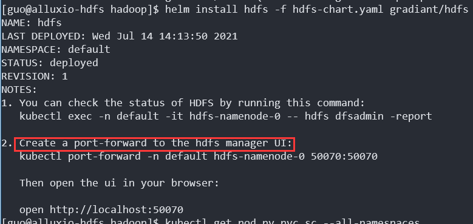
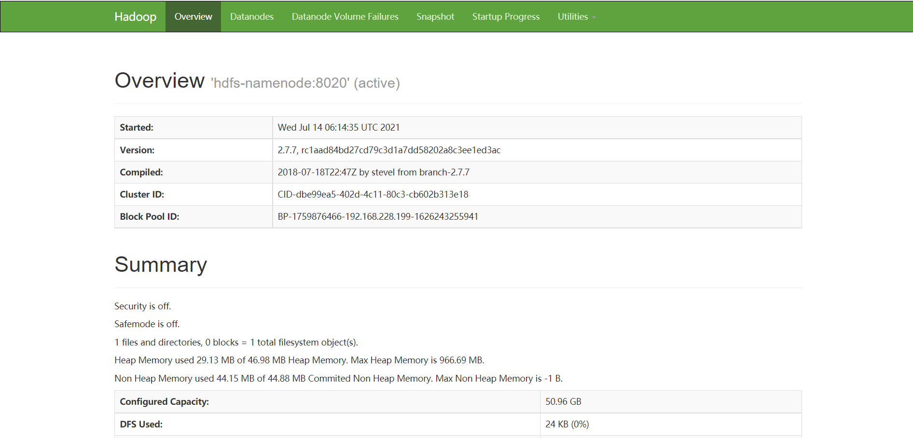
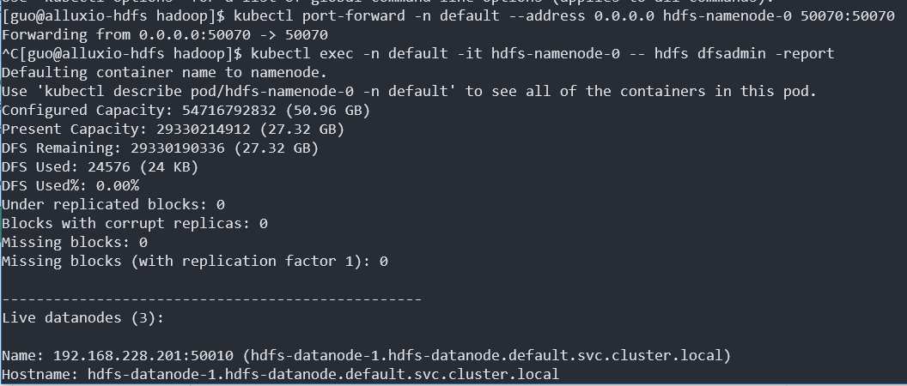
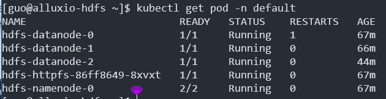

# k8s上部署Hadoop

集群环境：

- Centos7，20G硬盘，4G内存
- kubernetes-1.13.10

这里采用k8s包管理工具`helm`来安装`HDFS`集群，用到了[gradiant](https://artifacthub.io/packages/helm/gradiant/hdfs)镜像，部署文档地址：https://artifacthub.io/packages/helm/gradiant/hdfs。

```bash
helm repo add gaffer-docker https://gchq.github.io/gaffer-docker
# 添加gradiant的helm镜像
helm repo add gradiant https://gradiant.github.io/charts
```

使用下面的命令输出`gradiant/hdfs`镜像的默认配置，保存为`software/hadoop/hdfs-chart.yaml`，然后进入`software/hadoop`目录。

```bash
helm inspect values gradiant/hdfs > software/hadoop/hdfs-chart.yaml
cd software/hadoop
```

因为是笔记本虚拟机的环境，所以对`hdfs-chart.yaml`的`persistence:`部分做了修改：

```yaml
persistence:
  nameNode:
    enabled: true
    accessMode: ReadWriteOnce
    storageClass: "standard"
    volumeType: hostPath
    hostPath: "var/lib/hdfs/namenode"
    size: 10Gi
  dataNode:
    enabled: true
    storageClass: "standard"
    volumeType: hostPath
    hostPath: "var/lib/hdfs/datanode"
    accessMode: ReadWriteOnce
    size: 10Gi
```


使用下面的命令安装`HDFS`：

```bash
helm install hadoop \
  --set persistence.nameNode.enabled=true \
  --set persistence.nameNode.storageClass=standard \
  --set persistence.nameNode.size=5Gi \
  --set persistence.dataNode.enabled=true \
  --set persistence.dataNode.storageClass=standard \
  --set persistence.dataNode.size=10Gi \
  gradiant/hdfs
```

或者修改`hdfs-chart.yaml`中对应的值，修改完成后通过下面的命令安装`HDFS`:

```bash
helm install hdfs -f hdfs-chart.yaml gradiant/hdfs
```

配置文件中设置了`datanode`数量是3，所以要准备`10Gi`大小的`hostPath PV`一共4个。编写`yaml`文件创建`StorageClass`和`PV`：

```yaml
# volume-hp.yaml
apiVersion: v1
kind: PersistentVolume
metadata:
  name: namenode-pv
  labels:
    type: local
spec:
  storageClassName: standard
  capacity:
    storage: 10Gi
  accessModes:
    - ReadWriteOnce
  hostPath:
    path: "/var/lib/hdfs/namenode"
---
apiVersion: v1
kind: PersistentVolume
metadata:
  name: datanode-pv
  labels:
    type: local
spec:
  storageClassName: standard
  capacity:
    storage: 10Gi
  accessModes:
    - ReadWriteOnce
  hostPath:
    path: "/var/lib/hdfs/datanode"
---
apiVersion: v1
kind: PersistentVolume
metadata:
  name: datanode-1-pv
  labels:
    type: local
spec:
  storageClassName: standard
  capacity:
    storage: 10Gi
  accessModes:
    - ReadWriteOnce
  hostPath:
    path: "/var/lib/hdfs/datanode-1"
---
apiVersion: v1
kind: PersistentVolume
metadata:
  name: datanode-pv-2
  labels:
    type: local
spec:
  storageClassName: standard
  capacity:
    storage: 10Gi
  accessModes:
    - ReadWriteOnce
  hostPath:
    path: "/var/lib/hdfs/datanode-2"
---
apiVersion: storage.k8s.io/v1
kind: StorageClass
metadata:
  name: standard
  annotations:
    storageclass.kubernetes.io/is-default-class: true
provisioner: kubernetes.io/no-provisioner
```

```bash
# 通过yaml文件创建存储类和持久化存储卷
kubectl apply -f volume-hp.yaml
# 把standard设为默认存储类
kubectl patch storageclass standard -p '{"metadata": {"annotations":{"storageclass.kubernetes.io/is-default-class":"true"}}}'
# 可以通过把is-default-class设为false来取消默认存储类的设置
kubectl patch storageclass standard -p '{"metadata": {"annotations":{"storageclass.kubernetes.io/is-default-class":"false"}}}'
```

创建以后等一段时间就可以看到`persistentVolumeClaim`都已经处于绑定状态，`namenode`和`datanode`节点也开始创建镜像。

**ImagePullBackOff**


**HDFS运行成功**



使用下面的命令来进行端口转发并从主机浏览器访问http://<虚拟机IP>:50070/，发现无法响应。通过`telnet`命令检查端口状态发现只有从虚拟机本机访问才能成功连通，而从本地访问却没有响应。最终参考CSDN: [telnet登录不上,提示No route to host的解决方法](https://blog.csdn.net/melody_crs/article/details/78668450)放通端口的方法成功解决，原来问题在于防火墙。关闭防火墙也能够解决问题。

```bash
kubectl port-forward -n default hdfs-namenode-0 --address 0.0.0.0 50070:50070
# 通过firewall-cmd命令放通50070端口
sudo firewall-cmd --permanent --add-port 50070/tcp
sudo firewall-cmd --reload
```

此时在主机的浏览器中打开`HDFS web`页面，已经可以正常显示。



执行`dfsadmin -report`命令，也可以正常输出：

```bash
# 报告hdfs集群状况
kubectl exec -n default -it hdfs-namenode-0 -- hdfs dfsadmin -report
# 查看hdfs集群的pod节点
kubectl get pod -n default
```




集群共有2个namenode，3个datanode，以及1个web应用：




```bash
helm install hdfs -f values.yaml --set persistence.nameNode.enabled=true \
  --set persistence.nameNode.storageClass=standard \
  --set persistence.dataNode.enabled=true \
  --set persistence.dataNode.storageClass=standard \
  .
```


# `HDFS`配置

- `hdfs-site.xml`

```xml
<configuration>
    <property>
        <name>dfs.client.use.datanode.hostname</name>
        <value>true</value>
    </property>
    <property>
        <name>dfs.datanode.use.datanode.hostname</name>
        <value>true</value>
    </property>
    <property>
        <name>dfs.datanode.hostname</name>
        <value></value>
    </property>
    <property>
        <name>dfs.namenode.http-address</name>
        <value>0.0.0.0:9870</value>
    </property>
    <property>
        <name>dfs.namenode.https-address</name>
        <value>0.0.0.0:9871</value>
    </property>
    <property>
        <name>dfs.datanode.address</name>
        <value>0.0.0.0:9866</value>
    </property>
    <property>
        <name>dfs.datanode.ipc.address</name>
        <value>0.0.0.0:9867</value>
    </property>
    <property>
        <name>dfs.datanode.https.address</name>
        <value>0.0.0.0:9865</value>
    </property>
    <property>
        <name>dfs.balancer.address</name>
        <value>0.0.0.0:0</value>
    </property>
    <property>
        <name>dfs.journalnode.https-address</name>
        <value>0.0.0.0:8481</value>
    </property>
    <property>
        <name>dfs.journalnode.rpc-address</name>
        <value>0.0.0.0:8485</value>
    </property>
    <property>
        <name>dfs.namenode.secondary.https-address</name>
        <value>0.0.0.0:9869</value>
    </property>
    <property>
        <name>dfs.storage.policy.satisfier.address</name>
        <value>0.0.0.0:0</value>
    </property>
    <property>
        <name>dfs.namenode.backup.address</name>
        <value>0.0.0.0:50100</value>
    </property>
    <property>
        <name>dfs.namenode.secondary.http-address</name>
        <value>hdfs1:9001</value>
    </property>
    <property>
        <name>dfs.datanode.http.address</name>
        <value>0.0.0.0:9864</value>
    </property>
    <property>
        <name>dfs.namenode.backup.http-address</name>
        <value>0.0.0.0:50105</value>
    </property>
    <property>
        <name>dfs.journalnode.http-address</name>
        <value>0.0.0.0:8480</value>
    </property>
    <property>
        <name>dfs.mover.address</name>
        <value>0.0.0.0:0</value>
    </property>
    <property></property>
</configuration>
```


- `core-site.xml`

```xml
<configuration>
    <property>
        <name>fs.defaultFS</name>
        <value>hdfs://hdfs1:8020/</value>
    </property>
    <property>
        <name>fs.default.name</name>
        <value>hdfs://hdfs1:8020</value>
    </property>
</configuration>
```


- `yarn-site.xml`

```xml
<configuration>
    <property>
        <name>yarn.resourcemanager.webapp.address</name>
        <value>hdfs1:8088</value>
    </property>
    <property>
        <name>yarn.resourcemanager.scheduler.address</name>
        <value>hdfs1:8030</value>
    </property>
    <property>
        <name>yarn.resourcemanager.resource-tracker.address</name>
        <value>hdfs1:8031</value>
    </property>
    <property>
        <name>yarn.sharedcache.uploader.server.address</name>
        <value>0.0.0.0:8046</value>
    </property>
    <property>
        <name>yarn.router.webapp.https.address</name>
        <value>0.0.0.0:8091</value>
    </property>
    <property>
        <name>yarn.timeline-service.address</name>
        <value>${yarn.timeline-service.hostname}:10200</value>
    </property>
    <property>
        <name>yarn.nodemanager.amrmproxy.address</name>
        <value>0.0.0.0:8049</value>
    </property>
    <property>
        <name>yarn.nodemanager.collector-service.address</name>
        <value>${yarn.nodemanager.hostname}:8048</value>
    </property>
    <property>
        <name>yarn.nodemanager.address</name>
        <value>${yarn.nodemanager.hostname}:0</value>
    </property>
    <property>
        <name>yarn.sharedcache.webapp.address</name>
        <value>0.0.0.0:8788</value>
    </property>
    <property>
        <name>yarn.timeline-service.reader.webapp.address</name>
        <value>${yarn.timeline-service.webapp.address}</value>
    </property>
    <property>
        <name>yarn.nodemanager.localizer.address</name>
        <value>${yarn.nodemanager.hostname}:8040</value>
    </property>
    <property>
        <name>yarn.resourcemanager.address</name>
        <value>hdfs1:8032</value>
    </property>
    <property>
        <name>yarn.router.webapp.address</name>
        <value>0.0.0.0:8089</value>
    </property>
    <property>
        <name>yarn.nodemanager.webapp.https.address</name>
        <value>0.0.0.0:8044</value>
    </property>
    <property>
        <name>yarn.resourcemanager.webapp.https.address</name>
        <value>${yarn.resourcemanager.hostname}:8090</value>
    </property>
    <property>
        <name>yarn.timeline-service.webapp.https.address</name>
        <value>${yarn.timeline-service.hostname}:8190</value>
    </property>
    <property>
        <name>yarn.sharedcache.client-server.address</name>
        <value>0.0.0.0:8045</value>
    </property>
    <property>
        <name>yarn.timeline-service.reader.webapp.https.address</name>
        <value>${yarn.timeline-service.webapp.https.address}</value>
    </property>
    <property>
        <name>yarn.nodemanager.webapp.address</name>
        <value>${yarn.nodemanager.hostname}:8042</value>
    </property>

    <property>
        <name>yarn.resourcemanager.admin.address</name>
        <value>hdfs1:8033</value>
    </property>
    <property>
        <name>yarn.timeline-service.webapp.address</name>
        <value>${yarn.timeline-service.hostname}:8188</value>
    </property>
    <property>
        <name>yarn.sharedcache.admin.address</name>
        <value>0.0.0.0:8047</value>
    </property>

</configuration>
```


- `mapred-site.xml`

```xml
<configuration>
    <property>
        <name>mapreduce.jobhistory.webapp.address</name>
        <value>hdfs1:19888</value>
    </property>
    <property>
        <name>mapreduce.jobhistory.address</name>
        <value>hdfs1:10020</value>
    </property>
    <property>
        <name>mapreduce.jobhistory.admin.address</name>
        <value>0.0.0.0:10033</value>
    </property>
    <property>
        <name>mapreduce.jobhistory.webapp.https.address</name>
        <value>0.0.0.0:19890</value>
    </property>
</configuration>
```

# `Centos`配置静态路由

参考access.redhat.com文档[CONFIGURING STATIC ROUTES AND THE DEFAULT GATEWAY](https://access.redhat.com/documentation/en-us/red_hat_enterprise_linux/7/html/networking_guide/ch-configuring_static_routes_and_the_default_gateway)部分的内容。这里只记录了`ip route`命令和`ifcfg`文件的两种方式。其他方式参考[access.redhat.com: 4. CONFIGURING STATIC ROUTES AND THE DEFAULT GATEWAY](https://access.redhat.com/documentation/en-us/red_hat_enterprise_linux/7/html/networking_guide/ch-configuring_static_routes_and_the_default_gateway)。

## 临时方式（机器重启或网卡重启后失效）

```bash
ip route add IP/CIDR via NEXT_HOP dev INTERFACE
```


例如把目标网络为`172.16.102.0/24`的网络包下一跳设为`192.168.43.134`这个主机，并指定使用`ens33`这个网卡：

```bash
ip route add 172.16.102.0/24 via 192.168.43.134 dev ens33
```


## 持久方式

让静态路由的设置持久化的方法是在`/etc/sysconfig/network-scripts/`目录下建立一个`route-<interface>`文件，`<interface>`是网卡名称，例如`ens33`。

在`/etc/sysconfig/network-scripts/route-ens33`中写入与`ip route`命令格式兼容的路由：

```bash
# route-ens33
# [dev ens33]是可选的
172.16.102.0/24 via 192.168.43.134 [dev ens33]
```

上面这条记录就把通过主机`192.168.43.134`到达`172.16.102.0/24`这个目标网络的静态路由持久化了。

网络文件方式还可以接受下面的格式：

```bash
ADDRESS0=172.16.102.0
NETMASK0=255.255.255.0
GATEWAY0=192.168.43.134
```

`ADDRESS`和`NETMASK`指定`IP`地址和网络掩码，构成目标网络。`GATEWAY`指定网关或下一跳。

因为下面的记录起到了设置网关一样的效果，所以下一跳字段在这里叫做`GATEWAY`：

```bash
default via <GATEWAY> dev <interface>
```

这是一条默认路由，当目标网络找不到合适的路由时，就会走默认路由，把网络包发给网关。

# `HDFS`问题

```
2021-08-09 03:01:11,575 INFO org.apache.hadoop.hdfs.StateChange: BLOCK* allocate blk_1073741835_1011{UCState=UNDER_CONSTRUCTION, truncateBlock=null, primaryNodeIndex=-1, replicas=[ReplicaUC[[DISK]DS-abfaca43-d2f6-4558-88c9-394d3b2f5910:NORMAL:172.16.228.244:50010|RBW], ReplicaUC[[DISK]DS-f1536a16-5e65-49f8-97e3-fd3a20b84919:NORMAL:172.16.228.243:50010|RBW], ReplicaUC[[DISK]DS-76959c79-26e8-48f6-8396-d25560656e44:NORMAL:172.16.228.242:50010|RBW]]} for /alluxio/test-data/giga-1-5.csv
2021-08-09 03:01:32,669 WARN org.apache.hadoop.hdfs.server.blockmanagement.BlockPlacementPolicy: Failed to place enough replicas, still in need of 1 to reach 3 (unavailableStorages=[], storagePolicy=BlockStoragePolicy{HOT:7, storageTypes=[DISK], creationFallbacks=[], replicationFallbacks=[ARCHIVE]}, newBlock=true) For more information, please enable DEBUG log level on org.apache.hadoop.hdfs.server.blockmanagement.BlockPlacementPolicy
2021-08-09 03:01:32,670 WARN org.apache.hadoop.hdfs.protocol.BlockStoragePolicy: Failed to place enough replicas: expected size is 1 but only 0 storage types can be selected (replication=3, selected=[], unavailable=[DISK], removed=[DISK], policy=BlockStoragePolicy{HOT:7, storageTypes=[DISK], creationFallbacks=[], replicationFallbacks=[ARCHIVE]})
2021-08-09 03:01:32,670 WARN org.apache.hadoop.hdfs.server.blockmanagement.BlockPlacementPolicy: Failed to place enough replicas, still in need of 1 to reach 3 (unavailableStorages=[DISK], storagePolicy=BlockStoragePolicy{HOT:7, storageTypes=[DISK], creationFallbacks=[], replicationFallbacks=[ARCHIVE]}, newBlock=true) All required storage types are unavailable:  unavailableStorages=[DISK], storagePolicy=BlockStoragePolicy{HOT:7, storageTypes=[DISK], creationFallbacks=[], replicationFallbacks=[ARCHIVE]}
2021-08-09 03:01:32,671 INFO org.apache.hadoop.hdfs.StateChange: BLOCK* allocate blk_1073741836_1012{UCState=UNDER_CONSTRUCTION, truncateBlock=null, primaryNodeIndex=-1, replicas=[ReplicaUC[[DISK]DS-76959c79-26e8-48f6-8396-d25560656e44:NORMAL:172.16.228.242:50010|RBW], ReplicaUC[[DISK]DS-f1536a16-5e65-49f8-97e3-fd3a20b84919:NORMAL:172.16.228.243:50010|RBW]]} for /alluxio/test-data/giga-1-5.csv
2021-08-09 03:01:53,696 WARN org.apache.hadoop.hdfs.server.blockmanagement.BlockPlacementPolicy: Failed to place enough replicas, still in need of 2 to reach 3 (unavailableStorages=[], storagePolicy=BlockStoragePolicy{HOT:7, storageTypes=[DISK], creationFallbacks=[], replicationFallbacks=[ARCHIVE]}, newBlock=true) For more information, please enable DEBUG log level on org.apache.hadoop.hdfs.server.blockmanagement.BlockPlacementPolicy
2021-08-09 03:01:53,698 WARN org.apache.hadoop.hdfs.protocol.BlockStoragePolicy: Failed to place enough replicas: expected size is 2 but only 0 storage types can be selected (replication=3, selected=[], unavailable=[DISK], removed=[DISK, DISK], policy=BlockStoragePolicy{HOT:7, storageTypes=[DISK], creationFallbacks=[], replicationFallbacks=[ARCHIVE]})
2021-08-09 03:01:53,701 WARN org.apache.hadoop.hdfs.server.blockmanagement.BlockPlacementPolicy: Failed to place enough replicas, still in need of 2 to reach 3 (unavailableStorages=[DISK], storagePolicy=BlockStoragePolicy{HOT:7, storageTypes=[DISK], creationFallbacks=[], replicationFallbacks=[ARCHIVE]}, newBlock=true) All required storage types are unavailable:  unavailableStorages=[DISK], storagePolicy=BlockStoragePolicy{HOT:7, storageTypes=[DISK], creationFallbacks=[], replicationFallbacks=[ARCHIVE]}
2021-08-09 03:01:53,702 INFO org.apache.hadoop.hdfs.StateChange: BLOCK* allocate blk_1073741837_1013{UCState=UNDER_CONSTRUCTION, truncateBlock=null, primaryNodeIndex=-1, replicas=[ReplicaUC[[DISK]DS-f1536a16-5e65-49f8-97e3-fd3a20b84919:NORMAL:172.16.228.243:50010|RBW]]} for /alluxio/test-data/giga-1-5.csv
2021-08-09 03:02:14,711 INFO org.apache.hadoop.hdfs.server.namenode.FSEditLog: Number of transactions: 14 Total time for transactions(ms): 11 Number of transactions batched in Syncs: 0 Number of syncs: 8 SyncTimes(ms): 15
2021-08-09 03:02:14,716 WARN org.apache.hadoop.hdfs.server.blockmanagement.BlockPlacementPolicy: Failed to place enough replicas, still in need of 3 to reach 3 (unavailableStorages=[], storagePolicy=BlockStoragePolicy{HOT:7, storageTypes=[DISK], creationFallbacks=[], replicationFallbacks=[ARCHIVE]}, newBlock=true) For more information, please enable DEBUG log level on org.apache.hadoop.hdfs.server.blockmanagement.BlockPlacementPolicy
2021-08-09 03:02:14,716 WARN org.apache.hadoop.hdfs.protocol.BlockStoragePolicy: Failed to place enough replicas: expected size is 3 but only 0 storage types can be selected (replication=3, selected=[], unavailable=[DISK], removed=[DISK, DISK, DISK], policy=BlockStoragePolicy{HOT:7, storageTypes=[DISK], creationFallbacks=[], replicationFallbacks=[ARCHIVE]})
2021-08-09 03:02:14,716 WARN org.apache.hadoop.hdfs.server.blockmanagement.BlockPlacementPolicy: Failed to place enough replicas, still in need of 3 to reach 3 (unavailableStorages=[DISK], storagePolicy=BlockStoragePolicy{HOT:7, storageTypes=[DISK], creationFallbacks=[], replicationFallbacks=[ARCHIVE]}, newBlock=true) All required storage types are unavailable:  unavailableStorages=[DISK], storagePolicy=BlockStoragePolicy{HOT:7, storageTypes=[DISK], creationFallbacks=[], replicationFallbacks=[ARCHIVE]}
2021-08-09 03:02:14,718 INFO org.apache.hadoop.ipc.Server: IPC Server handler 8 on 8020, call org.apache.hadoop.hdfs.protocol.ClientProtocol.addBlock from 192.168.43.134:7863 Call#10 Retry#0
java.io.IOException: File /alluxio/test-data/giga-1-5.csv could only be replicated to 0 nodes instead of minReplication (=1).  There are 3 datanode(s) running and 3 node(s) are excluded in this operation.
        at org.apache.hadoop.hdfs.server.blockmanagement.BlockManager.chooseTarget4NewBlock(BlockManager.java:1620)
        at org.apache.hadoop.hdfs.server.namenode.FSNamesystem.getNewBlockTargets(FSNamesystem.java:3135)
        at org.apache.hadoop.hdfs.server.namenode.FSNamesystem.getAdditionalBlock(FSNamesystem.java:3059)
        at org.apache.hadoop.hdfs.server.namenode.NameNodeRpcServer.addBlock(NameNodeRpcServer.java:725)
        at org.apache.hadoop.hdfs.protocolPB.ClientNamenodeProtocolServerSideTranslatorPB.addBlock(ClientNamenodeProtocolServerSideTranslatorPB.java:493)
        at org.apache.hadoop.hdfs.protocol.proto.ClientNamenodeProtocolProtos$ClientNamenodeProtocol$2.callBlockingMethod(ClientNamenodeProtocolProtos.java)
        at org.apache.hadoop.ipc.ProtobufRpcEngine$Server$ProtoBufRpcInvoker.call(ProtobufRpcEngine.java:616)
        at org.apache.hadoop.ipc.RPC$Server.call(RPC.java:982)
        at org.apache.hadoop.ipc.Server$Handler$1.run(Server.java:2217)
        at org.apache.hadoop.ipc.Server$Handler$1.run(Server.java:2213)
        at java.security.AccessController.doPrivileged(Native Method)
        at javax.security.auth.Subject.doAs(Subject.java:422)
        at org.apache.hadoop.security.UserGroupInformation.doAs(UserGroupInformation.java:1762)
        at org.apache.hadoop.ipc.Server$Handler.run(Server.java:2211)
```

