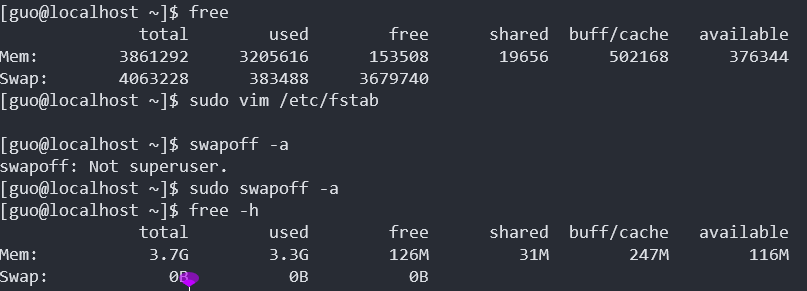

# 部署`Kubernetes`集群

## 安装docker（[centos](https://docs.docker.com/engine/install/centos/)）

[Ubuntu安装docker](https://docs.docker.com/engine/install/ubuntu/)。

**Set up the repository**

Install the `yum-utils` package (which provides the `yum-config-manager` utility) and set up the **stable** repository.

```
$ sudo yum install -y yum-utils

$ sudo yum-config-manager \
    --add-repo \
    https://download.docker.com/linux/centos/docker-ce.repo
```

安装最新版本：

```bash
sudo yum install docker-ce docker-ce-cli containerd.io
```

安装指定版本：

```bash
 yum list docker-ce --showduplicates | sort -r
```

此命令会显示软件仓库中可用的版本，版本号是冒号和连字符中间的部分。安装选定版本的docker：

```bash
sudo yum install docker-ce-<VERSION_STRING> docker-ce-cli-<VERSION_STRING> containerd.io
```


这里安装`docker 18.06`版本：

```bash
yum install docker-ce-18.06.3.ce docker-ce-cli-18.06.3.ce containerd.io
```


```bash
# 启动docker
sudo systemctl start docker
# 测试hello-world
sudo docker run hello-world
```

### [Manage Docker as a non-root user](https://docs.docker.com/engine/install/linux-postinstall/#manage-docker-as-a-non-root-user)

需要创建一个`docker`用户组。

To create the `docker` group and add your user:

1. Create the `docker` group.

   ```bash
   $ sudo groupadd docker
   ```

2. Add your user to the `docker` group.

   ```bash
   $ sudo usermod -aG docker $USER
   ```

3. 重新登陆用户刷新用户组身份。

   执行以下命令，使用户组生效：

   ```bash
   $ newgrp docker 
   ```

4. 测试一下：Verify that you can run `docker` commands without `sudo`.

   ```bash
   $ docker run hello-world
   ```

   这个命令会从`docker hub`下载测试镜像，并在容器中运行。

   如果在添加用户组之前已经运行过`docker run hello-world`，可能会出现下面的错误。这是因为由root用户运行之后导致的`~/.docker`路径的权限错误。

   ```bash
   WARNING: Error loading config file: /home/user/.docker/config.json -
   stat /home/user/.docker/config.json: permission denied
   ```

   使用下面的命令修改路径的权限即可：

   ```bash
   $ sudo chown "$USER":"$USER" /home/"$USER"/.docker -R
   $ sudo chmod g+rwx "$HOME/.docker" -R
   ```

### [设置docker镜像源](https://blog.csdn.net/qq_35606010/article/details/104750391)

编辑或新建`/etc/docker/daemon.json`:

```
# cat /etc/docker/daemon.json
{
    "registry-mirrors": ["https://lwll293m.mirror.aliyuncs.com", "https://registry.docker-cn.com","http://hub-mirror.c.163.com","https://docker.mirrors.ustc.edu.cn", "https://pee6w651.mirror.aliyuncs.com"],
    "live-restore": true
}
```

然后重启`docker`：

```bash
sudo systemctl restart docker
```


### docker常用命令

```
docker ps
docker container ls
docker images -f [key1=name1,...]
# key=
```

### 使用docker运行容器

命令格式：

```bash
docker run [OPTIONS] IMAGE[:TAG|@DIGEST] [COMMAND] [ARG...]
```

**前后台**：

- 后台运行`[-d]`：

通过`[-d]`参数指定后台运行的容器，在容器的根进程退出时容器直接关闭。

参数`--rm`。

- 前台运行：


```bash
-a=[]           : Attach to `STDIN`, `STDOUT` and/or `STDERR`
-t              : Allocate a pseudo-tty
--sig-proxy=true: Proxy all received signals to the process (non-TTY mode only)
-i              : Keep STDIN open even if not attached
```


**设置网络**[[docker网络设置](https://docs.docker.com/engine/reference/run/#network-settings)]：

```bash
--dns=[]           : Set custom dns servers for the container
--network="bridge" : Connect a container to a network
                      'bridge': create a network stack on the default Docker bridge
                      'none': no networking
                      'container:<name|id>': reuse another container's network stack
                      'host': use the Docker host network stack
                      '<network-name>|<network-id>': connect to a user-defined network
--network-alias=[] : Add network-scoped alias for the container
--add-host=""      : Add a line to /etc/hosts (host:IP)
--mac-address=""   : Sets the container's Ethernet device's MAC address
--ip=""            : Sets the container's Ethernet device's IPv4 address
--ip6=""           : Sets the container's Ethernet device's IPv6 address
--link-local-ip=[] : Sets one or more container's Ethernet device's link local IPv4/IPv6 addresses
```

`--net`支持的网络设置有 :

| Network                  | Description                                                  |
| :----------------------- | :----------------------------------------------------------- |
| **none**                 | No networking in the container.                              |
| **bridge** (default)     | Connect the container to the bridge via veth interfaces.     |
| **host**                 | Use the host's network stack inside the container.           |
| **container**:<name\|id> | Use the network stack of another container, specified via its *name* or *id*. |
| **NETWORK**              | Connects the container to a user created network (using `docker network create` command) |

通过`--add-host`可以给容器添加主机名到ip的映射，相当于修改了容器的`/etc/hosts`。

```bash
$ docker run -it --add-host db-static:86.75.30.9 ubuntu cat /etc/hosts

172.17.0.22     09d03f76bf2c
fe00::0         ip6-localnet
ff00::0         ip6-mcastprefix
ff02::1         ip6-allnodes
ff02::2         ip6-allrouters
127.0.0.1       localhost
::1	            localhost ip6-localhost ip6-loopback
86.75.30.9      db-static
```

### 添加容器数据卷VOLUME (shared filesystems)

```bash
-v, --volume=[host-src:]container-dest[:<options>]: Bind mount a volume.
The comma-delimited `options` are [rw|ro], [z|Z],
[[r]shared|[r]slave|[r]private], and [nocopy].
The 'host-src' is an absolute path or a name value.

If neither 'rw' or 'ro' is specified then the volume is mounted in
read-write mode.

The `nocopy` mode is used to disable automatically copying the requested volume
path in the container to the volume storage location.
For named volumes, `copy` is the default mode. Copy modes are not supported
for bind-mounted volumes.

--volumes-from="": Mount all volumes from the given container(s)
```


## 安装kubenetes环境


### [安装 kubeadm、kubelet 和 kubectl](https://kubernetes.io/zh/docs/setup/production-environment/tools/kubeadm/install-kubeadm/#%E5%AE%89%E8%A3%85-kubeadm-kubelet-%E5%92%8C-kubectl)

设置阿里云的软件仓库：

```bash
# /etc/yum.repos.d/kubernetes.repo
[Kubernetes]
name=Kubernetes
baseurl=https://mirrors.aliyun.com/kubernetes/yum/repos/kubernetes-el7-x86_64/
enabled=1
gpgcheck=1
repo_gpgcheck=1
gpgkey=https://mirrors.aliyun.com/kubernetes/yum/doc/yum-key.gpg https://mirrors.aliyun.com/kubernetes/yum/doc/rpm-package-key.gpg
```

更新本地软件包索引并安装：

- 通过运行命令 `setenforce 0` 和 `sed ...` 将 SELinux 设置为 permissive 模式 可以有效地将其禁用。 这是允许容器访问主机文件系统所必需的，而这些操作时为了例如 Pod 网络工作正常。

  你必须这么做，直到 kubelet 做出对 SELinux 的支持进行升级为止。

```bash
# 更新后输出软件仓库列表
sudo yum repolist

# 将 SELinux 设置为 permissive 模式（相当于将其禁用）
sudo setenforce 0
sudo sed -i 's/^SELINUX=enforcing$/SELINUX=permissive/' /etc/selinux/config

```

**关闭`swapoff`**

安装`kubernetes`之前要先关闭`swap`，否则会提示`[ERROR Swap]: running with swap on is not supported. Please disable swap`。

通过下面的命令关闭`swap`，并把`/etc/fstab`文件中`swap`对应的行注释掉：

```bash
sudo swapoff -a
cat /etc/fstab

#
# /etc/fstab
# Created by anaconda on Tue Jul 27 14:23:04 2021
#
# Accessible filesystems, by reference, are maintained under '/dev/disk'
# See man pages fstab(5), findfs(8), mount(8) and/or blkid(8) for more info
#
/dev/mapper/centos-root /                       xfs     defaults        0 0
UUID=fe5b0acd-e46b-4de3-ae85-a47b6e7332ab /boot                   xfs     defaults        0 0
# /dev/mapper/centos-swap swap                    swap    defaults        0 0
```


关闭`swap`之前和关闭之后：



现在安装`kubeadm, kubelet, kubectl`

```bash
# 安装指定版本的kubernetes，不指定版本则默认安装最新版
sudo yum install kubectl<-version> kubeadm<-version> kubelet<-version>

sudo systemctl enable --now kubelet
```


现在kubelet会处于每隔几秒就重启的状态，在一个死循环中等待kubeadm指令。

### [配置 cgroup 驱动](https://kubernetes.io/zh/docs/tasks/administer-cluster/kubeadm/configure-cgroup-driver/)

kubeadm 支持在执行 `kubeadm init` 时，传递一个 `KubeletConfiguration` 结构体。 `KubeletConfiguration` 包含 `cgroupDriver` 字段，可用于控制 kubelet 的 cgroup 驱动。

```yaml
# kubeadm-config.yaml
kind: ClusterConfiguration
apiVersion: kubeadm.k8s.io/v1beta2
kubernetesVersion: v1.21.0
---
kind: KubeletConfiguration
apiVersion: kubelet.config.k8s.io/v1beta1
cgroupDriver: systemd
```

在kubeadm命令初始化时把`kubeadm-config.yaml`配置文件作为`--config`参数值传递。

使用下面的命令也可以输出`kubeadm init`初始化的默认配置，然后可以根据需要修改配置。

```bash
kubeadm config print init-defaults > kubeadm-cfg.yaml
```


### [使用 kubeadm 创建集群](https://kubernetes.io/zh/docs/setup/production-environment/tools/kubeadm/create-cluster-kubeadm/)

执行下面的命令拉取`kubernetes`集群初始化所需的`docker`镜像：

```bash
kubeadm config images pull --config kubeadm-cfg.yaml
```


查看需要获取的镜像：

```bash
kubeadm config images list
# k8s.gcr.io/kube-apiserver:v1.13.10
# k8s.gcr.io/kube-controller-manager:v1.13.10
# k8s.gcr.io/kube-scheduler:v1.13.10
# k8s.gcr.io/kube-proxy:v1.13.10
# k8s.gcr.io/pause:3.1
# k8s.gcr.io/etcd:3.2.24
# k8s.gcr.io/coredns:1.2.6
```

`k8s.gcr.io`的镜像通常无法访问，需要自定义`kubernetes`的初始化镜像源。

需要在[docker hub](https://hub.docker.com/)找到合适的镜像，对于`kubernetes-1.21.3-0`版本这里选择了`aiotceo`的镜像。直接修改`kubeadm-cfg.yaml`中`imageRepository`或者手动拉取镜像。

因为kubeadm init过程中无法自动拉取需要的镜像，需要编写脚本手动下载：


```shell
# pull_and_tag_images.sh
# kubernetes v1.13.10的镜像
#!/bin/sh

docker pull mirrorgooglecontainers/kube-apiserver:v1.13.10
docker pull mirrorgooglecontainers/kube-controller-manager:v1.13.9
docker pull mirrorgooglecontainers/kube-scheduler:v1.13.8
docker pull mirrorgooglecontainers/kube-proxy:v1.13.9
docker pull mirrorgooglecontainers/pause:3.1
docker pull mirrorgooglecontainers/etcd:3.2.24
docker pull coredns/coredns:1.2.6

docker tag mirrorgooglecontainers/kube-apiserver:v1.13.10 k8s.gcr.io/kube-apiserver:v1.13.10
docker tag mirrorgooglecontainers/kube-controller-manager:v1.13.9 k8s.gcr.io/kube-controller-manager:v1.13.10
docker tag mirrorgooglecontainers/kube-scheduler:v1.13.8 k8s.gcr.io/kube-scheduler:v1.13.10
docker tag mirrorgooglecontainers/kube-proxy:v1.13.9 k8s.gcr.io/kube-proxy:v1.13.10
docker tag mirrorgooglecontainers/pause:3.1 k8s.gcr.io/pause:3.1
docker tag mirrorgooglecontainers/etcd:3.2.24 k8s.gcr.io/etcd:3.2.24
docker tag coredns/coredns:1.2.6 k8s.gcr.io/coredns:1.2.6
```

手动拉取镜像：

```bash
sudo chmod 777 pull_and_tag_images.sh
./pull_and_tag_imags.sh
```

拉取`kubeadm-cfg.yaml`中配置的镜像，如果是手动拉取镜像可以跳过这一个命令：

```bash
kubeadm config images pull --config kubeadm-cfg.yaml
```


用kubeadm命令初始化k8s集群：

```bash
kubeadm init --config /home/guo/software/k8s/kubeadm-config.yaml
```

使用下面的命令让普通用户可以运行kubernetes命令：

```bash
mkdir -p $HOME/.kube
sudo cp -i /etc/kubernetes/admin.conf $HOME/.kube/config
sudo chown $(id -u):$(id -g) $HOME/.kube/config
```

或者，如果你是 `root` 用户，则可以运行：

```bash
export KUBECONFIG=/etc/kubernetes/admin.conf
```

初始化结束后得到了一条命令可以用来把节点加入k8s集群：

```bash
kubeadm join 192.168.43.133:6443 --token f7jnau.3u9p453ra4mf0sze --discovery-token-ca-cert-hash sha256:8fa57ff2eb9524cd84290c5ecffcbbd59e679270c4fd8d294449cde513e93514
```


### 控制平面节点隔离

默认情况下，出于安全原因，你的集群不会在控制平面节点上调度 Pod。 如果你希望能够在控制平面节点上调度 Pod， 例如用于开发的单机 Kubernetes 集群，请运行：

```bash
kubectl taint nodes --all node-role.kubernetes.io/master-
```

输出看起来像：

```
node "test-01" untainted
taint "node-role.kubernetes.io/master:" not found
taint "node-role.kubernetes.io/master:" not found
```

这将从任何拥有 `node-role.kubernetes.io/master` taint 标记的节点中移除该标记， 包括控制平面节点，这意味着调度程序将能够在任何地方调度 Pods。


### 加入节点

节点是你的工作负载（容器和 Pod 等）运行的地方。要将新节点添加到集群，请对每台计算机执行以下操作：

- SSH 到机器
- 成为 root （例如 `sudo su -`）
- 运行 `kubeadm init` 输出的命令。例如：

```bash
kubeadm join --token <token> <control-plane-host>:<control-plane-port> --discovery-token-ca-cert-hash sha256:<hash>
```

如果没有`token`，可以通过在控制平面节点上运行以下命令来获取令牌：

```bash
kubeadm token list
```

输出类似于以下内容：

```console
TOKEN                    TTL  EXPIRES              USAGES           DESCRIPTION            EXTRA GROUPS
8ewj1p.9r9hcjoqgajrj4gi  23h  2018-06-12T02:51:28Z authentication,  The default bootstrap  system:
                                                   signing          token generated by     bootstrappers:
                                                                    'kubeadm init'.        kubeadm:
                                                                                           default-node-token
```

默认情况下，令牌会在24小时后过期。如果要在当前令牌过期后将节点加入集群， 则可以通过在控制平面节点上运行以下命令来创建新令牌：

```bash
kubeadm token create
```

输出类似于以下内容：

```console
5didvk.d09sbcov8ph2amjw
```

如果你没有 `--discovery-token-ca-cert-hash` 的值，则可以通过在控制平面节点上执行以下命令链来获取它：

```bash
openssl x509 -pubkey -in /etc/kubernetes/pki/ca.crt | openssl rsa -pubin -outform der 2>/dev/null | \
   openssl dgst -sha256 -hex | sed 's/^.* //'
```

输出类似于以下内容：

```console
8cb2de97839780a412b93877f8507ad6c94f73add17d5d7058e91741c9d5ec78
```

> **说明：** 要为 `<control-plane-host>:<control-plane-port>` 指定 IPv6 元组，必须将 IPv6 地址括在方括号中，例如：`[fd00::101]:2073`

输出应类似于：

```bash
[preflight] Running pre-flight checks

... (log output of join workflow) ...

Node join complete:
* Certificate signing request sent to control-plane and response
  received.
* Kubelet informed of new secure connection details.

Run 'kubectl get nodes' on control-plane to see this machine join.
```

几秒钟后，当你在控制平面节点上执行 `kubectl get nodes`，你会注意到该节点出现在输出中。


### 安装 Pod 网络附加组件

**flannel插件**

安装pod网络使pod间能够通信：

```bash
kubectl apply -f https://raw.githubusercontent.com/coreos/flannel/master/Documentation/kube-flannel.yml
```

- `unable to recognize "k8s/kube-flannel.yaml": Get http://localhost:8080/api?timeout=32s: dial tcp [::1]:8080: connect: connection refused`出现此错误，根据[flannel github](https://github.com/flannel-io/flannel/issues/1031)的回答不能使用root用户来运行这个命令，切换到普通用户后命令成功执行。
- `apply`执行后既没有报错也没有拉取镜像失败，但是查看`pod`发现`kube-flannel`的pod根本没有启动。`pod`列表相比安装`flannel`前没有任何变化。


> 上面使用的是`flannel`网络插件，但是经过很多尝试并寻找解决办法，`kube-flannel`的镜像总是无法运行起来。因此更换了`calico`插件。

**calico插件**（参考了`projectcalico.org`：[Install Calico with Kubernetes API datastore, 50 nodes or less](https://docs.projectcalico.org/getting-started/kubernetes/self-managed-onprem/onpremises#install-calico-with-kubernetes-api-datastore-50-nodes-or-less)）

***首先部署calico容器***

```bash
kubectl apply -f https://docs.projectcalico.org/v3.6/getting-started/kubernetes/installation/hosted/kubernetes-datastore/calico-networking/1.7/calico.yaml
```

把`calico.yaml`下载到本地执行`apply`命令，等待一段时间后查看`pod`容器：

```bash
kubectl get pod -n kube-system
```

有两个名字中带有`calico`的镜像状态在变化，过一段时间稳定后镜像运行起来，状态变成`Running`。发现`coredns`的状态也变成`Running`了。这时再查看节点：

```bash
kubectl get nodes
```

`master`节点的状态已经变成`Ready`。


***安装calicoctl工具***

参考[`calico-v3.6`][Install calicoctl as a binary on a single host](https://docs.projectcalico.org/getting-started/clis/calicoctl/install#install-calicoctl-as-a-binary-on-a-single-host)：

进入`/usr/local/bin`目录下，下载`calicoctl`二进制程序并给`calicoctl`设置可执行权限：

```bash
sudo curl -o calicoctl -O -L  "https://github.com/projectcalico/calicoctl/releases/download/v3.19.1/calicoctl" 
 
sudo  chmod +x calicoctl
# 然后返回之前的路径
cd -
```

`calicoctl`的一些命令需要`root`用户的权限，但是如果使用`sudo`会出现报错。例如：`Calico process is not running.`、`Failed to create Calico API client: invalid configuration: no configuration has been provided, try setting KUBERNETES_MASTER environment variable`等。这是因为`sudo`命令不会把当前用户的环境变量传递到`root`用户空间去，使用`-E`选项即可解决这个问题：

```bash
sudo -E calicoctl <your-command>
```


**`calico`日志目录`/var/log/calico/`**

```
allocate-tunnel-addrs  bird  bird6  cni  confd  felix  monitor-addresses
```


## 如何卸载kubernetes集群？


```bash
su
kubeadm reset -f
yum erase kubectl kubeadm kubelet kubernetes kube*
rm -rf ~/.kube


```

If you used disposable servers for your cluster, for testing, you can switch those off and do no further clean up. You can use `kubectl config delete-cluster` to delete your local references to the cluster.

However, if you want to deprovision your cluster more cleanly, you should first [drain the node](https://kubernetes.io/docs/reference/generated/kubectl/kubectl-commands#drain) and make sure that the node is empty, then deconfigure the node.

### Remove the node

Talking to the control-plane node with the appropriate credentials, run:

```bash
kubectl drain <node name> --delete-emptydir-data --force --ignore-daemonsets
```

Before removing the node, reset the state installed by `kubeadm`:

```bash
kubeadm reset
```

The reset process does not reset or clean up iptables rules or IPVS tables. If you wish to reset iptables, you must do so manually:

```bash
iptables -F && iptables -t nat -F && iptables -t mangle -F && iptables -X
```

If you want to reset the IPVS tables, you must run the following command:

```bash
ipvsadm -C
```

Now remove the node:

```bash
kubectl delete node <node name>
```

If you wish to start over, run `kubeadm init` or `kubeadm join` with the appropriate arguments.

### Clean up the control plane

You can use `kubeadm reset` on the control plane host to trigger a best-effort clean up.

See the [`kubeadm reset`](https://kubernetes.io/docs/reference/setup-tools/kubeadm/kubeadm-reset/) reference documentation for more information about this subcommand and its options.


## 常见问题

- `kubeadm init` 时提示`[ERROR Swap]: running with swap on is not supported. Please disable swap`: [Kubernetes 设计分析: 为什么 kubelet 运行时不能打开 swap？](https://www.jianshu.com/p/6f3268ce642f)

- `[WARNING IsDockerSystemdCheck]: detected "cgroupfs" as the Docker cgroup driver. The recommended driver is "systemd". Please follow the guide at https://kubernetes.io/docs/setup/cri/`: [Configuring a cgroup driver](https://kubernetes.io/docs/tasks/administer-cluster/kubeadm/configure-cgroup-driver/)设置kubeadm的cgroupfs为systemd, [Container runtimes](https://kubernetes.io/docs/setup/production-environment/container-runtimes/#docker)设置容器(`docker`)的cgroupfs为systemd

- `[ERROR FileContent--proc-sys-net-bridge-bridge-nf-call-iptables]:` 根据提示，需要把`/proc/sys/net/bridge/bridge-nf-call-iptables`的内容设为`1`，但是不能直接编辑这个文件。而是要修改`/etc/sysctl.conf`，然后执行`sudo sysctl -p`。参考`stackoverflow`: [Can't install Kubernetes on Vagrant](https://stackoverflow.com/questions/44125020/cant-install-kubernetes-on-vagrant)。

  ```bash
  # 在 /etc/sysctl.conf中加入对应的值
  cat /etc/sysctl.conf
  net.bridge.bridge-nf-call-iptables = 1
  
  # 载入内核模块br_netfilter
  sudo modprobe br_netfilter
  
  # 加载内核参数
  sudo sysctl -p
  ```

  

还有一个有用的命令可以用来定位出错`pod`的问题：

```bash
kubectl logs <pod name> -p -n <namespace>
```

- [kubectl 命令参考文档](https://kubernetes.io/docs/reference/generated/kubectl/kubectl-commands)
- [kubectl命令速查文档](https://kubernetes.io/docs/reference/kubectl/cheatsheet/#viewing-finding-resources)

## 设置k8s Dashboard [Web UI (Dashboard)](https://kubernetes.io/docs/tasks/access-application-cluster/web-ui-dashboard/)

```bash
kubectl apply -f https://raw.githubusercontent.com/kubernetes/dashboard/v2.2.0/aio/deploy/recommended.yaml
```

把`yaml`资源清单下载到本地以后，执行`apply`操作（在本地另存为`k8s-dashboard.yaml`）。查看`k8s-dashboard.yaml`的内容可以看到`dashboard`应用的命名空间是`kubernetes-dashboard`，使用下面的命令查询`dashboard pod`的状态:

```bash
kubectl get pod -n kubernetes-dashboard 
```

**nodeSelector问题**

发现两个`dashboard`都处于`Pending`状态，等待一段时间仍然无法运行起来：


使用下面的命令查看事件，发现出现了无法调度的问题，原因是不满足调度程序的节点选择条件：

```bash
kubectl get events --namespace=kubernetes-dashboard
```


再次查看`k8s-dashboard.yaml`发现有两处`nodeSelector:`的配置，把两段`nodeSelector`全部注释掉即可。

```bash
# 删除dashboard的pod节点，之后用新的k8s-dashboard.yaml启动pod
kubectl delete -f k8s-dashboard.yaml
kubectl apply -f k8s-dashboard.yaml
```

查询`pod`状态，看到`dashboard`开始创建镜像，等待一段时间后成功运行。


还有一个有用的命令可以用来定位出错`pod`的问题：

```bash
kubectl logs <pod name> -p -n <namespace>
```

**ImagePullBackOff问题**

问题描述：执行`apply`以后`dashboard`可以成功运行，但是过一段时间再次查看时就会发现叫做`kubernetes-dashboard-<55885cf4d8-xwvxg>`的`pod`状态变成`ImagePullBackOff`，而且重启次数比较大。


查看`yaml`文件发现有一项`imagePullPolicy`的配置设成了`Always`，改成`IfNotPresent`以后重新apply`dashboard`就可以正常运行了。

```bash
kubectl delete -f k8s/plugins/webui/k8s-dashboard.yaml
kubectl apply -f k8s/plugins/webui/k8s-dashboard.yaml
```


**从集群外访问webUI**

两个`dashboard pod`成功运行后执行下面的命令，如果没有出错就可以在主机通过http://localhost:8001/api/v1/namespaces/kubernetes-dashboard/services/https:kubernetes-dashboard:/proxy/访问`k8s WebUI`。

```bash
kubectl proxy
```


**参考文章**

[博客园：Kubernetes集群的部署方式及详细步骤](https://www.cnblogs.com/huhyoung/p/9657186.html)

[知乎：Kubernetes概念理解及单节点集群搭建](https://zhuanlan.zhihu.com/p/88428871)

CSDN：[Kubernetes系列：k8s 1.14单节点安装](https://blog.csdn.net/Gordon_luo/article/details/92804536)